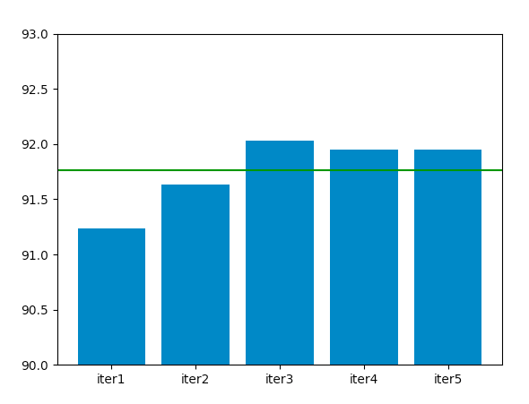
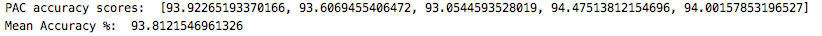
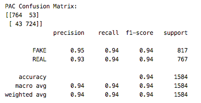

# Fake-News-Detection

This project explores the use of supervised learning models to detect fake news with a 7796×4 dataset (source: Data Flair). The dataset can be viewed here: https://drive.google.com/file/d/1er9NJTLUA3qnRuyhfzuN0XUsoIC4a-_q/view

## News.csv format:
Column 1 | Column 2 | Column 3 | Column 4 
   ID    |   Title  |   Text   |   Label ("Real"/"Fake")

## Outputs
### Accuracy of 5-fold Cross Validated Logisitic Regression

### Accuracy of 5-fold Cross Validated Passive Aggressive Classifer

### Train Test Split on Logit and PAC

## Improvements
Some potential next steps include:
* improve data quality for learning 
* test additional models for performance
* introduce additional attributes/factor columns 
